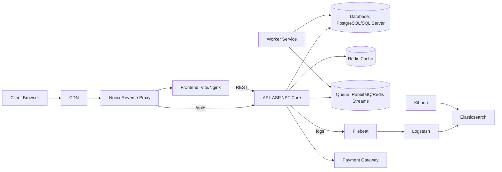
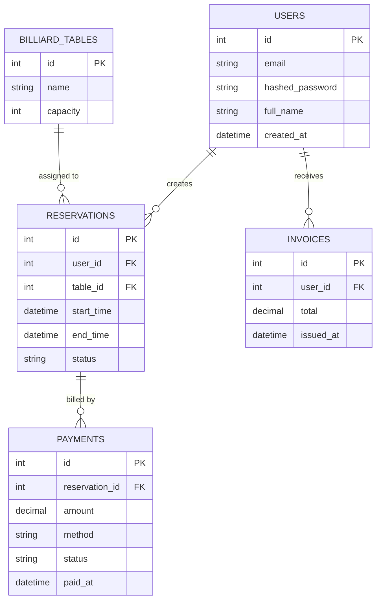

# PRODUCTION-MACHINE — Hệ thống Production và Hạ tầng

**Phiên bản:** 1.0.0  
**Cập nhật:** 2026-05-27

> Tài liệu này mô tả chi tiết hạ tầng production (thư mục `production-machine`) và mối quan hệ với hệ thống `devops-ck` (BilliardsBooking). Mọi giả định được chỉ rõ ở phần cuối.

---

## Mục lục

- [1. Tổng Quan Hệ Thống](#1-tổng-quan-hệ-thống)
- [2. Kiến Trúc Tổng Thể](#2-kiến-trúc-tổng-thể)
  - [Sơ đồ kiến trúc (Mermaid)](#sơ-đồ-kiến-trúc-mermaid)
  - [Sơ đồ luồng dữ liệu](#sơ-đồ-luồng-dữ-liệu)
- [3. Cấu Trúc Source Code](#3-cấu-trúc-source-code)
- [4. Luồng Hoạt Động Hệ Thống](#4-luồng-hoạt-động-hệ-thống)
- [5. Thiết Kế Cơ Sở Dữ Liệu](#5-thiết-kế-cơ-sở-dữ-liệu)
- [6. Tài liệu API](#6-tài-liệu-api)
- [7. Xác thực & Bảo mật](#7-xác-thực--bảo-mật)
- [8. Chiến lược Caching](#8-chiến-lược-caching)
- [9. Hàng đợi & Công việc nền](#9-hàng-đợi--công-việc-nền)
- [10. Hệ thống thời gian thực](#10-hệ-thống-thời-gian-thực)
- [11. Luồng AI/ML (nếu có)](#11-luồng-aiml-nếu-có)
- [12. DevOps & Triển khai](#12-devops--triển-khai)
- [13. Giám sát & Ghi log](#13-giám-sát--ghi-log)
- [14. Tối ưu hiệu năng](#14-tối-ưu-hiệu-năng)
- [15. Phục hồi thảm họa](#15-phục-hồi-thảm-họa)
- [16. Chiến lược kiểm thử](#16-chiến-lược-kiểm-thử)
- [17. Quy chuẩn mã nguồn](#17-quy-chuẩn-mã-nguồn)
- [18. Thiết lập môi trường](#18-thiết-lập-môi-trường)
- [19. Chiến lược mở rộng](#19-chiến-lược-mở-rộng)
- [20. Nâng cấp tương lai](#20-nâng-cấp-tương-lai)
- [21. Giả định & Thuật ngữ](#21-giả-định--thuật-ngữ)
- [22. Phụ lục: Cấu hình ví dụ & đoạn mã](#22-phụ-lục-cấu-hình-ví-dụ--đoạn-mã)

---

# 1. Tổng Quan Hệ Thống

## Mục tiêu hệ thống
- Triển khai và vận hành môi trường production cho hệ thống BilliardsBooking.
- Đảm bảo sẵn sàng, an toàn, dễ quan sát và có quy trình triển khai/rollback rõ ràng.

## Business problem
Hệ thống phục vụ đặt bàn bi-a, quản lý thành viên, thanh toán và hoá đơn. Yêu cầu chính: thời gian phản hồi thấp cho trải nghiệm người dùng, độ chính xác trong đặt chỗ, an toàn dữ liệu thanh toán và khả năng giám sát/vận hành.

## Use cases
- Người dùng: đăng ký, đăng nhập, tìm bàn, đặt/bỏ đặt, thanh toán.
- Staff: quản lý bảng, xác nhận đặt chỗ, phát hành hoá đơn.
- Admin: báo cáo, audit, cấu hình hệ thống.

## Người dùng chính
- End users (khách hàng) 🎯
- Staff / Admin 🛠️
- DevOps / SRE 👩‍💻
- Developers 🧑‍💻

## Phạm vi hệ thống
Tài liệu tập trung vào hạ tầng production trong `production-machine/` và cách nó kết nối với `devops-project-backend` và `devops-project-frontend`.

---

# 2. Kiến Trúc Tổng Thể

## Architectural pattern
- Monolith API (ASP.NET Core) + SPA frontend (Vite) được container hoá.  
- Reverse proxy bằng Nginx, centralized logging bằng ELK (Filebeat → Logstash → Elasticsearch), worker queues (RabbitMQ/Redis streams), cache Redis.

## Giải thích kiến trúc
- Nginx chịu TLS termination + route request tới frontend hoặc backend.  
- Backend (API) xử lý nghiệp vụ chính, kết nối DB quan hệ; sử dụng Redis cho cache & session; publish tasks tới queue cho việc gửi email/thanh toán.  
- Filebeat thu log container, gửi tới Logstash để parse → Elasticsearch.  

### Sơ đồ kiến trúc (Mermaid)



### Sơ đồ luồng dữ liệu
- Client gửi request → Nginx → API  
- API thực hiện auth → đọc/ghi DB → trả về response  
- Các hành động async (email, invoice, payment reconciliation) push vào queue để worker xử lý.

---

# 3. Cấu Trúc Source Code

> Dưới đây mô tả structure tập trung vào `production-machine/`.

## Cấu trúc thư mục (production-machine)

```
production-machine/
├─ .env
├─ deploy.sh
├─ docker-compose.yml
├─ nginx.conf
├─ MONITORING.md
├─ README.md
├─ elasticsearch/
│  └─ init-templates.sh
├─ filebeat/
│  ├─ Dockerfile
│  └─ filebeat.yml
├─ logstash/
│  └─ pipeline/
│     └─ logstash.conf
└─ Vagrant/
   └─ Vagrantfile
```

## 3.1 Chi tiết file trong `production-machine` (mô tả chức năng và liên kết)

Phần này mô tả từng file/cấu phần trong thư mục `production-machine`, cách hoạt động, và mối quan hệ giữa các file.

- `.env`
  - Mục đích: chứa các biến môi trường dùng bởi `docker-compose.yml` và các script triển khai (ví dụ: `MAIL_HOST`, `MAIL_USERNAME`, `DB_CONN`).
  - Lưu ý: không lưu secrets thật trong repo; file này chỉ dùng mẫu cho môi trường dev hoặc được generate/điền bởi hệ thống CI/secret manager.

- `deploy-runtime.log`
  - Mục đích: log runtime cho `deploy.sh` (một file log runtime được ghi bởi script khi chạy trên VM).  
  - Nội dung: lịch sử pull image, trạng thái deploy, thông báo lỗi (nếu có).  
  - Liên kết: `deploy.sh` ghi log tới file này.

- `deploy.sh`
  - Mục đích: script chính để tự động deploy trên máy production/VM.  
  - Hoạt động chính:
    1. Tạo lock file `/tmp/deploy.lock` và dùng `flock` để tránh chạy trùng lặp.  
    2. Định nghĩa hàm `retry_pull` để pull image (5 lần, delay 15s) — giúp bền hơn với sự cố mạng/registry.  
    3. Pull image backend/frontend (các biến `BACKEND_IMAGE`/`FRONTEND_IMAGE` được hardcode trong file hiện tại).  
    4. Chạy `docker compose up -d --remove-orphans` tại thư mục ứng dụng để khởi động/đổi container.  
    5. Dọn image không sử dụng bằng `docker image prune -af`.  
    6. Ghi kết quả và thông tin container đang chạy vào `deploy-runtime.log`.
  - Thiết kế: script chạy non-interactive, exit code phản ánh lỗi nghiêm trọng; ghi log đầy đủ để điều tra.
  - Liên kết: chạy bởi Vagrant provisioning và cron job (xem `Vagrant/Vagrantfile`), tương tác trực tiếp với `docker-compose.yml`.

- `docker-compose.yml`
  - Mục đích: định nghĩa toàn bộ stack trên một node (DB, backend, frontend, nginx, elasticsearch, kibana, logstash, filebeat, elasticsearch-setup).  
  - Các service chính và vai trò:
    - `db`: SQL Server container (cổng 1433). Healthcheck dùng `sqlcmd`.
    - `backend`: API (.NET) chạy cổng 8080; phụ thuộc `db` healthy.
    - `frontend`: static SPA; phụ thuộc `backend` healthy.
    - `nginx`: reverse proxy, map `nginx.conf` vào container, expose cổng `80` và `5000` (legacy).  
    - `elasticsearch`, `kibana`, `logstash`, `filebeat`: ELK stack để thu thập và hiển thị log.
    - `elasticsearch-setup`: container tạm để chạy `init-templates.sh` khi Elasticsearch sẵn sàng.
  - Healthchecks: nhiều service cấu hình healthcheck để `depends_on` có thể chờ service healthy trước khi khởi chạy các service khác.
  - Volumes & Networks: `sqlserver_data` và `esdata` để persist dữ liệu; network `app-network` tách giao tiếp giữa container.
  - Liên kết: `docker-compose.yml` là điểm trung tâm mà `deploy.sh` khởi chạy; `nginx.conf`, `logstash/pipeline/logstash.conf`, `filebeat/filebeat.yml`, và `elasticsearch/init-templates.sh` được mount/khởi chạy bởi compose.

- `nginx.conf`
  - Mục đích: cấu hình reverse proxy cho frontend và backend, xử lý legacy port `5000` và bật CORS cho endpoint này.
  - Chi tiết:
    - Block server trên cổng `80`: proxy `/api/` tới `http://backend:8080` và route `/` tới `http://frontend:80`.
    - Block server trên cổng `5000`: hỗ trợ legacy JS code cố dùng `localhost:5000`, bật CORS và proxy tất cả request tới backend.
  - Liên kết: file được mount vào container `nginx` trong `docker-compose.yml`; giúp chuyển tiếp traffic tới service nội bộ.

- `filebeat/` (Dockerfile và `filebeat.yml`)
  - Mục đích: thu log container từ host Docker socket/paths và forward đến Logstash (beats input).  
  - Cấu hình chính (`filebeat.yml`): input type `container` paths `/var/lib/docker/containers/*/*.log`, processors thêm metadata docker/host, output tới `logstash:5044`, monitoring tới Elasticsearch.
  - Liên kết: `filebeat` phụ thuộc `logstash` trong compose; mount `/var/lib/docker/containers` và `docker.sock` để lấy metadata container.

- `logstash/pipeline/logstash.conf`
  - Mục đích: nhận input từ Filebeat (Beats) và từ TCP JSON ở cổng 5000, parse logs, enrich và index vào Elasticsearch.
  - Chi tiết xử lý:
    - Input: `beats` (5044) và `tcp` JSON (5000) — cho phép app hoặc Nginx có thể gửi JSON trực tiếp vào Logstash.
    - Filter: loại bỏ log của chính ELK stack; parse JSON message nếu bắt đầu bằng `{`; grok pattern cho các log dạng `HTTP request completed/failed` và `nginx access log` để trích trường quan trọng như method, path, status, duration, traceId, userId.
    - Output: gửi vào Elasticsearch index `app-logs-%{+YYYY.MM.dd}`.
  - Liên kết: Logstash nhận từ Filebeat; output tới `elasticsearch` service; cấu hình được mount từ repo.

- `elasticsearch/init-templates.sh`
  - Mục đích: khi `elasticsearch` sẵn sàng, script tạo index template cho pattern `app-logs-*` và set số replica/shard phù hợp cho single-node dev/prod nhẹ.
  - Hoạt động: chờ cluster healthy rồi PUT template & cập nhật cài đặt index (replicas = 0 trong cấu hình hiện tại).
  - Liên kết: được chạy bởi service `elasticsearch-setup` trong `docker-compose.yml`, phụ thuộc vào `elasticsearch` healthy.

- `MONITORING.md`
  - Mục đích: hướng dẫn giám sát và kiểm tra trạng thái hệ thống (health endpoints, Kibana, các lệnh `curl` / `docker compose ps`).
  - Nội dung chính: chỉ ra endpoints health (`/health`), cách tạo Kibana data view `app-logs-*`, các panel gợi ý, và lệnh chẩn đoán cho Elasticsearch indices.
  - Liên kết: tham khảo cấu hình Logstash/Filebeat/Elasticsearch đã cài trong compose để tạo dashboard.

- `README.md` (thư mục production-machine)
  - Mục đích: hướng dẫn nhanh cách provision VM bằng Vagrant, deploy bằng `deploy.sh`, xử lý sự cố cơ bản và thao tác trên VM.
  - Nội dung: cách `vagrant up`, provision, cron job deploy (đã tạo trong Vagrantfile), lệnh dùng khi khắc phục.

- `Vagrant/Vagrantfile`
  - Mục đích: provision VM (Ubuntu Jammy) để mô phỏng/host môi trường production trên VirtualBox hoặc provider tương thích.
  - Hoạt động chính:
    - Sync thư mục host → `/home/vagrant/app` trong VM.  
    - Cấu hình private IP `192.168.56.11`, forward ports (80->8080 host, 5000->5001 host, 1433->1433).  
    - Provision script: cài Docker, Docker Compose plugin, thêm user `vagrant` vào nhóm `docker`, chạy `deploy.sh` và tạo cron job để chạy `deploy.sh` mỗi giờ.
  - Liên kết: Vagrant dùng `deploy.sh` và `docker-compose.yml` trong repo để provision và duy trì stack; cron job đảm bảo deploy tự động hàng giờ.

### Sơ đồ liên kết (tóm tắt)

 - `Vagrantfile` provision VM → mount `production-machine` vào `/home/vagrant/app` → chạy `deploy.sh` và tạo cron job.
 - `deploy.sh` → pull images (registry), chạy `docker compose up -d --remove-orphans` → `docker-compose.yml` khởi tạo services.
 - `docker-compose.yml` → khởi các service: `nginx`, `backend`, `frontend`, `db`, `elasticsearch`, `kibana`, `logstash`, `filebeat`, `elasticsearch-setup`.
 - `nginx.conf` → Nginx container proxy request tới `frontend` và `backend`.
 - `filebeat` → thu logs container → gửi tới `logstash`.
 - `logstash` → parse và gửi logs vào `elasticsearch`.
 - `elasticsearch-setup` → chạy `init-templates.sh` để tạo template index trước khi Logstash ghi dữ liệu.
 - `kibana` → hiển thị dữ liệu từ `elasticsearch`.

Mỗi file/cấu hình ở trên đều là một mắt xích trong pipeline deploy → runtime → observability. Khi sửa đổi bất kỳ cấu hình nào (nginx, logstash, filebeat), cần redeploy stack (`docker compose up -d`) và kiểm tra health/indices trong Kibana.

## Giải thích từng folder
- `.env`: biến môi trường (PRODUCTION - không commit giá trị thật).  
- `deploy.sh`: script triển khai (pull images, chạy migration, restart services).  
- `docker-compose.yml`: cấu hình service production tại node này.  
- `nginx.conf`: cấu hình reverse proxy, TLS, security headers.  
- `elasticsearch/`, `filebeat/`, `logstash/`: cấu hình pipeline logging.  
- `Vagrant/`: môi trường dev/provisioning (không dùng cho production chính thức).

## Vai trò từng module
- `nginx`: public entrypoint, TLS, rate-limit, WAF (optional).  
- `api`: xử lý nghiệp vụ.  
- `frontend`: static SPA.  
- `filebeat/logstash/elasticsearch/kibana`: observability.  

## Dependency giữa các module
- `nginx` cần `frontend` & `api` hoạt động.  
- `logstash` cần `elasticsearch` để index.  
- `worker` cần `queue` & `db` & `redis`.

---

# 4. Luồng Hoạt Động Hệ Thống

## User request lifecycle
1. Client → DNS/CDN → `nginx`.  
2. `nginx` route traffic: tài nguyên tĩnh → `frontend`, API → `api`.  
3. `api` xác thực (JWT) → thực hiện nghiệp vụ → đọc/ghi DB → trả response.  
4. Log tạo ra → stdout → Filebeat → Logstash → Elasticsearch.

## Authentication flow
- Flow dùng Access Token (JWT) + Refresh Token.  
- Access token ngắn hạn (~15 phút), Refresh token dài hạn (cất trong httpOnly cookie hoặc persisted token server-side).  

Pseudo-flow:

```text
POST /api/auth/login -> returns { access_token, refresh_token }
Client attaches `Authorization: Bearer <access_token>`
On 401 -> POST /api/auth/refresh with refresh_token -> new tokens
Logout -> POST /api/auth/logout -> invalidate refresh token server-side
```

## Authorization flow
- RBAC: roles `User`, `Staff`, `Admin`.  
- Policy-based authorization: endpoints kiểm tra claims/permissions trong JWT.

## Data processing flow
- Synchronous: CRUD trực tiếp với DB.  
- Asynchronous: Publish event -> Queue -> Worker xử lý (email, payment callback, invoice generation).

## Error handling flow
- Middleware capture exception -> log error (structured) -> trả response chuẩn hoá: `{ code, message, details }`.

## Retry mechanism
- HTTP calls: retry với exponential backoff + jitter.  
- Background jobs: retry (1m, 5m, 15m...) → sau N lần chuyển sang DLQ.

## Logging flow
- Structured JSON logs, các trường tiêu chuẩn: `timestamp`, `level`, `service`, `traceId`, `spanId`, `message`, `meta`.

---

# 5. Database Design

> Giả định: hệ thống sử dụng RDBMS (PostgreSQL hoặc SQL Server). Dưới là mô tả ERD cơ bản rút ra từ models/DTOs.

## ERD (Mermaid)



## Bảng dữ liệu (tóm tắt)

| Table | Key columns | Ghi chú |
|---|---:|---|
| `users` | id, email, hashed_password | Unique index trên `email` |
| `billiard_tables` | id, name, capacity | Config static |
| `reservations` | id, user_id, table_id, start_time, status | Index `start_time`, `table_id` |
| `payments` | id, reservation_id, amount, status | FK ràng buộc |
| `invoices` | id, user_id, total, issued_at | Dùng cho báo cáo |

## Relationships
- One-to-many giữa `users` và `reservations`.  
- One-to-many giữa `billiard_tables` và `reservations`.

## Indexing strategy
- `users(email)` unique.  
- Composite index: `reservations(table_id, start_time)`.  
- Index `payments(status)` cho reconciliation.

## Migration strategy
- Sử dụng EF Core Migrations hoặc Flyway.  
- Quy trình deploy:
  1. Backup DB.  
  2. Run migrations (non-blocking nếu có feature toggle).  
  3. Validate schema với health checks.

## Data lifecycle
- Logs: retention 30-90 ngày (tùy cấu hình ES).  
- PII: hỗ trợ purging/anonymization theo chính sách bảo mật.

---

# 6. Tài liệu API

> Các endpoint chính được mô tả mẫu; đội phát triển nên dùng OpenAPI/Swagger để sinh tài liệu chi tiết.

## Mẫu chuẩn
- Responses chuẩn:

```json
{
  "success": true,
  "data": {...},
  "errors": null
}
```

- Error mẫu:

```json
{
  "success": false,
  "errors": [{ "code": "ValidationError", "field": "email", "message": "Email invalid" }]
}
```

---

### POST /api/auth/login
- Method: `POST`
- Headers: `Content-Type: application/json`
- Request body:

```json
{
  "email": "user@example.com",
  "password": "P@ssw0rd!"
}
```

- Success 200:

```json
{
  "success": true,
  "data": {
    "access_token": "eyJhbGci...",
    "expires_in": 900,
    "refresh_token_id": "uuid"
  }
}
```

- Errors: `400` (validation), `401` (invalid credentials)
- Rate limit: 10 req/min per IP

---

### POST /api/reservations
- Method: `POST`
- Auth: Bearer token
- Request body:

```json
{
  "tableId": 42,
  "startTime": "2026-06-01T18:00:00Z",
  "durationMinutes": 60
}
```

- Success 201:

```json
{
  "success": true,
  "data": { "reservationId": 123, "status": "Confirmed" }
}
```

- Errors: `400` (validation), `409` (time slot conflict)
- Rate limit: 60 req/min per user

---

### GET /api/admin/reports/daily
- Method: `GET`
- Auth: Admin
- Response: aggregated metrics JSON

---

## Validation & Status codes
- `400` Bad Request for malformed payloads.  
- `401` Unauthorized for missing/invalid token.  
- `403` Forbidden for permission issues.  
- `404` Not Found for missing resources.  
- `409` Conflict for booking collisions.  
- `500` Server Error for unhandled exceptions.

---

# 7. Xác thực & Bảo mật

## JWT / Refresh Token
- JWT chứa `sub`, `roles`, `permissions`, `iat`, `exp`.  
- Refresh tokens stored server-side (DB) with device metadata; support revoke.

## RBAC & Permission system
- Roles map to permissions; policy-based checks tại controller/service layer.

## Encryption
- TLS everywhere (Nginx terminate TLS).  
- DB encrypted at rest (provider-managed) và in-transit.

## Secret management
- Secrets không commit. Dùng Vault / AWS Secrets Manager / Azure Key Vault.  
- `deploy.sh` đọc secrets từ secret manager (recommended).

## CSRF / XSS / SQL Injection protection
- CSRF: API sử dụng header Authorization; nếu dùng cookies thì bảo vệ bằng SameSite + CSRF token.  
- XSS: output encode, CSP headers.  
- SQLi: ORM + parameterized queries.

## Security best practices
- Images không chạy root.  
- Scanning images trong CI.  
- Rotate keys & least privilege.

---

# 8. Chiến lược Caching

## Redis usage
- Sử dụng cho: session store, rate limiter, availability cache.
- Key naming: `app:{env}:<entity>:<id>`.

## Cache invalidation
- Cache-aside pattern: read cache -> if miss read DB and set cache.  
- On write, invalidate related keys.

## TTL recommendations
- Availability: 10s–60s.  
- Static config: 12h.

## Perf optimization
- Use Redis pipelining & Hashes để giảm overhead.

---

# 9. Hàng đợi & Công việc nền

## Queue architecture
- Preferred: RabbitMQ (complex routing) hoặc Redis Streams (simpler).  
- Queues: `email`, `payment`, `invoice`, `reporting`.

## Workers
- Containerized workers subscribe queue, xử lý job, gửi kết quả/metrics.

## Retry & DLQ
- Retry với exponential backoff.  
- Sau N attempt -> move to DLQ with metadata và error trace.

## Scheduling
- Use CronJobs (Kubernetes) hoặc scheduler service cho tasks định kỳ.

---

# 10. Hệ thống thời gian thực

## WebSocket / SignalR
- Repo có `Hubs/TableStatusHub.cs` → sử dụng SignalR.  
- Multi-instance SignalR → Redis backplane để đồng bộ connection.

## Pub/Sub flow
- Reservation events -> publish -> SignalR push tới clients.

---

# 11. Luồng AI/ML (nếu có)

> Hiện không có module AI rõ ràng. Nếu tích hợp tương lai:
- Tách service inference.  
- Lưu embeddings vào vector DB (Pinecone/Elastic/FAISS).  
- RAG architecture cho hỗ trợ chat/FAQ.

---

# 12. DevOps & Triển khai

## Docker & docker-compose
- Mỗi service 1 image: `api`, `frontend`, `worker`, `nginx`, `filebeat`, `logstash`, `elasticsearch`.

### Mẫu `docker-compose.yml` (tóm tắt)

```yaml
version: '3.8'
services:
  nginx:
    image: nginx:stable
    volumes:
      - ./nginx.conf:/etc/nginx/nginx.conf:ro
    ports:
      - "80:80"
      - "443:443"
    depends_on:
      - frontend
      - api

  frontend:
    image: registry.example.com/devops-project-frontend:latest

  api:
    image: registry.example.com/devops-project-backend:latest
    environment:
      - ConnectionStrings__Default=${DB_CONN}
    depends_on:
      - db
      - redis

  filebeat:
    build: ./filebeat
    volumes:
      - /var/lib/docker/containers:/var/lib/docker/containers:ro
```

# `deploy.sh` (sổ tay triển khai)

- Mục tiêu: Pull image → migrate DB → khởi động containers → kiểm tra sức khỏe.

**Lưu ý bảo mật:** không lưu secrets trực tiếp trong script.

### Ví dụ các bước triển khai

```bash
#!/usr/bin/env bash
set -euo pipefail

docker-compose pull api frontend worker
# optional: backup DB
docker-compose up -d --no-deps --build api frontend worker
# run migrations
docker run --rm registry.example.com/devops-project-backend:latest dotnet ef database update --no-build
# health check
curl -f https://localhost/health
```

## Kubernetes
- Phiên bản nâng cao: di chuyển sang K8s + Helm chart cho tính sẵn sàng, autoscaling, rollout strategy.

## CI/CD
- Build pipelines: lint -> unit tests -> build images -> integration tests -> push to registry -> trigger deploy.

## Environment variables
- Đặt trong Vault/secret manager; inject qua environment của container/pod.

## Rollback strategy
- Tag images với version; để rollback: deploy previous tag, validate health, rollback DB nếu cần (cẩn trọng).

---

# 13. Giám sát & Ghi log

## Logging
- Structured JSON logs → Filebeat → Logstash → ES → Kibana dashboards.
- Include `traceId` per request for correlation.

## Metrics
- App exposes `/metrics` (Prometheus).  
- Grafana dashboards: latency (p95/p99), error rate, throughput, queue depth.

## Tracing
- OpenTelemetry to export traces to Jaeger/APM.

## Alerting
- Alerts: error rate, response latency, queue backlog, disk usage, ES cluster health.  
- Channel: Slack/PagerDuty.

---

# 14. Tối ưu hiệu năng

## Bottleneck analysis
- DB write contention during peak bookings.  
- Nginx TLS CPU-bound.

## Strategy
- DB: use connection pooling, optimize queries, add read replicas.  
- API: cache read-heavy endpoints, async processing.  
- Frontend: CDN, asset minification, HTTP caching.

---

# 15. Phục hồi thảm họa

## Backup strategy
- Daily DB backups, incremental logs; store in offsite object storage (S3).

## Failover
- Multi-AZ DB or managed DB failover.  
- Replicated ES cluster.

## Recovery process
1. Detect incident & page on-call.  
2. Switch traffic to failover.  
3. Restore from backup if necessary.

---

# 16. Chiến lược kiểm thử

## Unit tests
- Test business logic, controllers.  
- `devops-project-backend.Tests` chứa test skeleton.

## Integration tests
- Run with test DB (docker-compose).  

## E2E tests
- Use Playwright/Cypress for user flows.

## Load tests
- Use k6 or Gatling to simulate peak.

## Security tests
- Dependency scanning, SAST, periodic pentest.

---

# 17. Quy chuẩn mã nguồn

## Naming conventions
- C# models/DTOs PascalCase.  
- JSON camelCase keys.  

## Git workflow
- Branch pattern: `feature/*`, `hotfix/*`, `release/*`.  
- PR + code review required before merge to `main`.

## Commit convention
- Adopt Conventional Commits: `feat:`, `fix:`, `chore:`.

---

# 18. Thiết lập môi trường

## Thiết lập cục bộ
1. Clone repo.  
2. Sao chép `.env.example` → `.env` (điền giá trị dev).  
3. Khởi động hạ tầng:

```bash
cd production-machine
docker-compose -f docker-compose.yml up --build -d
```

4. Chạy migrations & tests:

```bash
dotnet ef database update
dotnet test devops-project-backend.Tests
```

## Docker setup (production)
- Ensure Docker Engine + Compose trên máy production.  
- CI push images, `deploy.sh` pull & start.

---

# 19. Chiến lược mở rộng

## Horizontal scaling
- Replica multiple API instances behind Nginx.  
- Stateless API, stateful DB scaled separately.

## Database scaling
- Read replicas, partitioning, sharding (nếu cần).

## CDN
- Dùng CDN cho static assets để giảm tải origin.

---

# 20. Nâng cấp tương lai

- Tách worker thành microservices để độc lập scale.  
- Migrate orchestration sang Kubernetes + Helm.  
- Managed logging/monitoring services để giảm operational cost.  
- Harden security posture (WAF, IDS, least privilege).

---

# 21. Giả định & Thuật ngữ

## Assumptions quan trọng
- Backend: ASP.NET Core + EF Core.  
- DB: PostgreSQL/SQL Server (RDBMS).  
- Queue: RabbitMQ hoặc Redis Streams.  
- Observability: ELK + Prometheus/Grafana.  
- Images được build & push từ CI pipeline.

## Glossary
- DLQ: Dead Letter Queue
- RBAC: Role-Based Access Control
- ELK: Elasticsearch, Logstash, Kibana
- SPA: Single Page Application

---

# 22. Phụ lục: Cấu hình ví dụ & đoạn mã

## `nginx.conf` (proxy + security headers)

```nginx
server {
    listen 80;
    server_name example.com;

    location / {
        proxy_pass http://frontend:80;
        proxy_set_header Host $host;
        proxy_set_header X-Real-IP $remote_addr;
        proxy_set_header X-Forwarded-For $proxy_add_x_forwarded_for;
    }

    location /api/ {
        proxy_pass http://api:80;
        proxy_http_version 1.1;
        proxy_set_header Upgrade $http_upgrade;
        proxy_set_header Connection "upgrade";
        proxy_set_header Host $host;
    }

    add_header X-Content-Type-Options nosniff;
    add_header X-Frame-Options DENY;
    add_header Strict-Transport-Security "max-age=31536000; includeSubDomains" always;
}
```

## `filebeat.yml` (đơn giản)

```yaml
filebeat.inputs:
- type: container
  paths:
    - /var/lib/docker/containers/*/*.log
processors:
  - add_docker_metadata: ~
output.logstash:
  hosts: ["logstash:5044"]
```

## `logstash.conf` (pipeline)

```conf
input { beats { port => 5044 } }
filter {
  json { source => "message" target => "json" remove_field => ["message"] }
  mutate { rename => { "[json][level]" => "log.level" } }
}
output { elasticsearch { hosts => ["elasticsearch:9200"] index => "app-logs-%{+YYYY.MM.dd}" } }
```

## Ví dụ request/response API: tạo reservation

**Request**:

```http
POST /api/reservations
Authorization: Bearer <token>
Content-Type: application/json

{
  "tableId": 5,
  "startTime": "2026-06-01T18:00:00Z",
  "durationMinutes": 90
}
```

**Response**:

```json
{
  "success": true,
  "data": {
    "reservationId": 789,
    "status": "Confirmed",
    "startTime": "2026-06-01T18:00:00Z",
    "endTime": "2026-06-01T19:30:00Z"
  }
}
```

---

## Hướng dẫn onboard: Bắt đầu nhanh cho developer mới

**Yêu cầu tiên quyết**: Docker, Docker Compose, .NET SDK, Node 18+, npm/yarn

1. Clone repo.  
2. Sao chép `.env.example` → `.env` (điền giá trị dev).  
3. Khởi động hạ tầng:

```bash
cd production-machine
docker-compose up --build -d
```

4. Chạy test backend:

```bash
dotnet test devops-project-backend.Tests
```

5. Khởi động frontend:

```bash
cd devops-project-frontend
npm install
npm run dev
```

---

## Sổ tay vận hành (thực thi nhanh)

- Kiểm tra service:

```bash
docker-compose ps
docker logs -f production-machine_api_1
```

- Restart service:

```bash
docker-compose up -d --no-deps --build api
```

- Rollback nhanh:
  1. deploy previous image tag  
  2. restart service  
  3. kiểm tra health

---

## Lưu ý / Cảnh báo

> ⚠️ **Cảnh báo:** Tuyệt đối không commit secrets. Sử dụng Vault hoặc Secret Manager.  
> ⚠️ **Cảnh báo:** Trước khi chạy migrations trên production luôn tạo backup DB.  
> ℹ️ **Ghi chú:** `Vagrant/` chỉ dùng cho local/dev reproduction, không dùng cho production chính.

---
